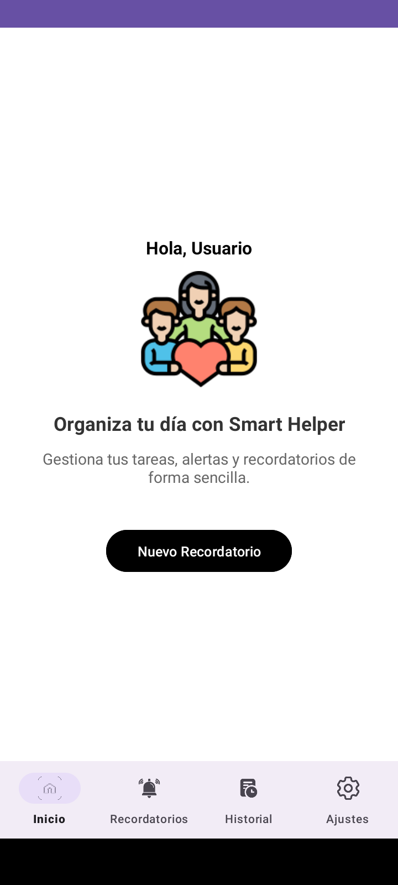
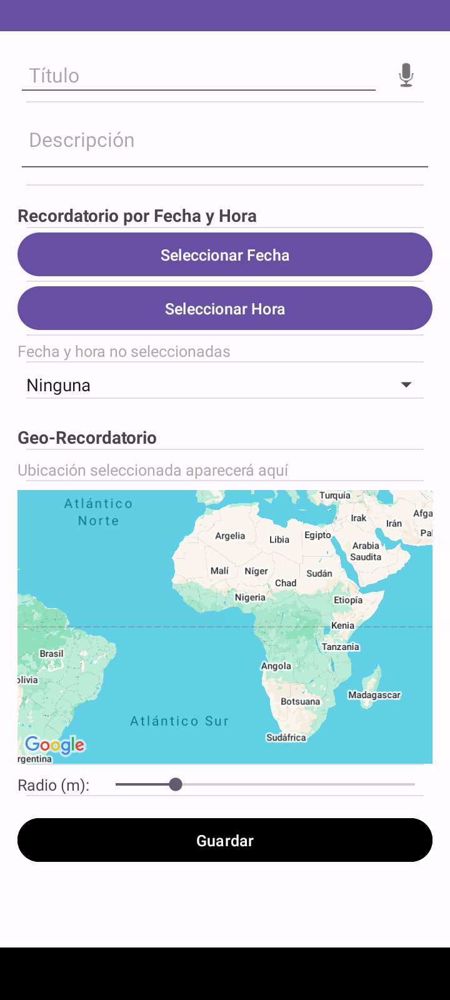
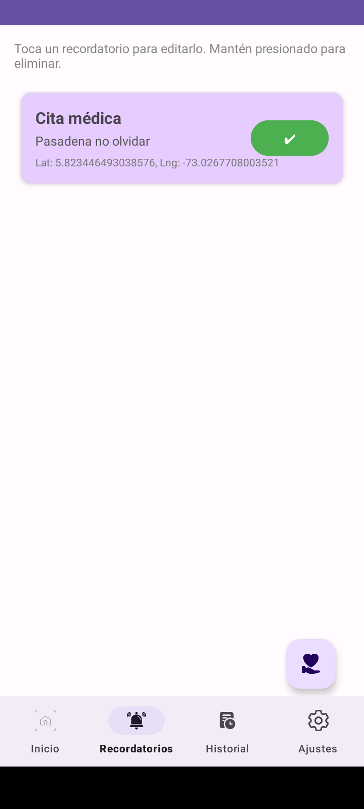
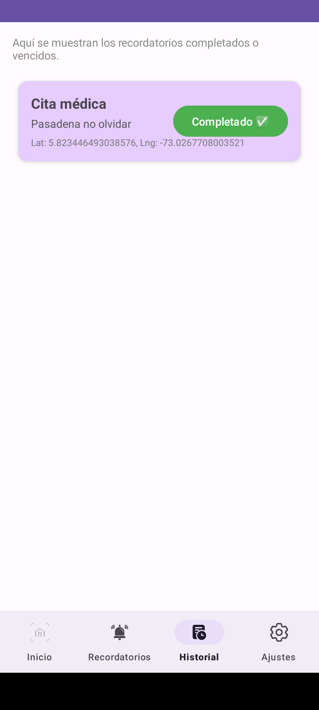
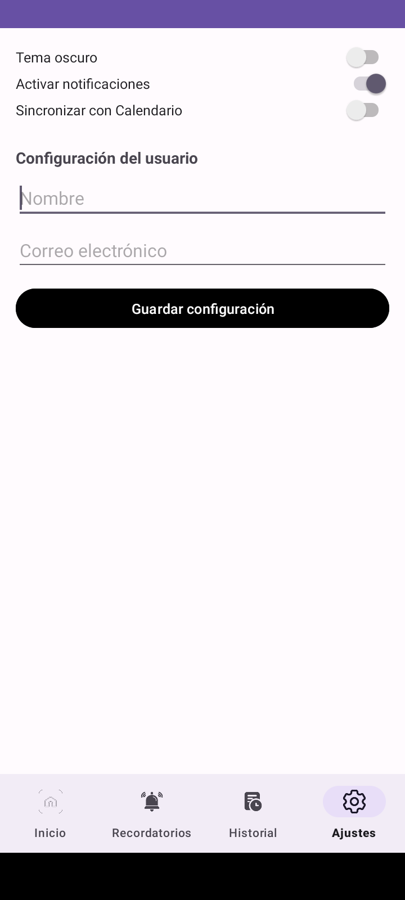

# 📱 Smart Helper

Aplicación móvil Android desarrollada en Java para la gestión inteligente de recordatorios, geolocalización y organización personal.

---

## 📖 Descripción

Smart Helper es una aplicación diseñada para ayudar a los usuarios a gestionar sus actividades diarias mediante recordatorios tradicionales y geo-recordatorios basados en ubicación.

La aplicación permite programar tareas por fecha y hora, generar alertas automáticas, crear recordatorios asociados a una ubicación geográfica y administrar configuraciones personalizadas del usuario.

Este proyecto fue desarrollado como proyecto académico de Ingeniería de Sistemas aplicando conceptos de desarrollo móvil, bases de datos locales, geolocalización, notificaciones y experiencia de usuario.

---

## ✨ Funcionalidades

### 📝 Gestión de Recordatorios

- Crear recordatorios personalizados.
- Registrar título y descripción.
- Seleccionar fecha y hora.
- Configurar frecuencia de repetición.
- Guardar información localmente.

### 📍 Geo-Recordatorios

- Selección de ubicación mediante Google Maps.
- Configuración de radio de activación.
- Geofencing.
- Activación automática al ingresar o salir de una zona.

### 🔔 Sistema de Notificaciones

- Notificaciones locales.
- Alertas programadas.
- Posponer recordatorios por 10 minutos.
- Canal de notificaciones personalizado.

### 🎤 Reconocimiento de Voz

- Captura de texto mediante voz.
- Apoyo en la creación rápida de recordatorios.

### 📅 Integración con Calendario

- Solicitud de permisos de calendario.
- Sincronización opcional.

### 📚 Historial

- Consulta de recordatorios completados.
- Seguimiento de actividades realizadas.

### ⚙️ Configuración

- Datos del usuario.
- Activación/desactivación de notificaciones.
- Configuración de sincronización.
- Soporte para tema visual.

---

## 🏗️ Arquitectura del Proyecto

```text
jdc.trabajos.smarthelper
│
├── activities
│   ├── MainActivity
│   ├── CrearRecordatorioActivity
│   └── EditarGeoRecordatorioActivity
│
├── adapters
│
├── broadcasts
│   └── GeofenceBroadcastReceiver
│
├── database
│   ├── AppDatabase
│   └── RecordatorioDao
│
├── fragments
│   ├── InicioFragment
│   ├── RecordatoriosFragment
│   ├── HistorialFragment
│   └── AjustesFragment
│
├── helpers
│   ├── AlertaReceiver
│   ├── GeofenceHelper
│   ├── NotificationHelper
│   └── ReprogramarReceiver
│
└── models
    └── Recordatorio
```

---

## 🛠️ Tecnologías Utilizadas

### Lenguaje

- Java

### Desarrollo Móvil

- Android Studio
- Android SDK

### Persistencia de Datos

- Room Database
- SQLite

### Geolocalización

- Google Maps SDK
- Google Play Services Location
- Geofencing API

### Navegación

- Fragments
- Navigation Component

### Notificaciones

- AlarmManager
- BroadcastReceiver
- NotificationCompat

### Diseño

- Material Design
- ConstraintLayout

---
## 🎥 Video demostrativo

Puedes visualizar una demostración completa de Smart Helper en el siguiente video:

[▶ Ver video demostrativo en GitHub](https://github.com/Ing-MairaAlejandraRangel/smart-helper-android/blob/main/demo/smart-helper-demo.mp4)

El video muestra:

- Creación de recordatorios
- Creación de geo-recordatorios
- Selección de ubicación mediante Google Maps
- Notificaciones
- Historial de tareas
- Configuración de usuario
- Navegación mediante BottomNavigationView

## Capturas de pantalla

### Inicio


### Crear Recordatorio


### Recordatorios


### Historial


### Ajustes


## 📦 Requisitos

- Android 8.0 (API 26) o superior.
- Google Play Services.
- Permisos de ubicación.
- Permisos de notificaciones.
- Permisos de calendario.

---

## 🚀 Instalación

1. Clonar el repositorio.

```bash
git clone https://github.com/Ing-MairaAlejandraRangel/smart-helper.git
```

2. Abrir el proyecto en Android Studio.

3. Sincronizar Gradle.

4. Configurar Google Maps API Key.

5. Ejecutar en emulador o dispositivo físico.

---

## ✅ Estado del Proyecto

Proyecto funcional y probado en dispositivo Android físico.

### Funcionalidades verificadas

- ✔ Creación de recordatorios
- ✔ Geo-recordatorios
- ✔ Geofencing
- ✔ Room Database
- ✔ Notificaciones
- ✔ Historial
- ✔ Configuración de usuario
- ✔ Reconocimiento de voz
- ✔ Google Maps

---

## 👩‍💻 Autora

### Maira Alejandra Rangel Murillo

Ingeniera de Sistemas

**Áreas de interés:**

- Desarrollo Full Stack
- Desarrollo Android
- Backend Development
- QA Testing
- Bases de Datos
- APIs REST

### LinkedIn

www.linkedin.com/in/maira-alejandra-rangel-murillo

### GitHub

https://github.com/Ing-MairaAlejandraRangel

---

## 📄 Licencia

Proyecto desarrollado con fines académicos y de portafolio profesional.